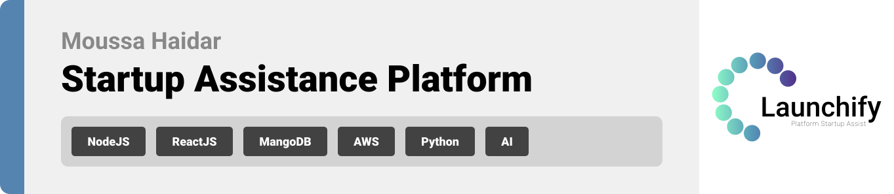

  

<!-- project philosophy -->

>### Platform Overview
Develop a Startup Assistance Platform designed to provide personalized support, resources, and tools for startups at various stages. By leveraging AI and machine learning, the platform offers tailored recommendations, mentorship, and networking opportunities to help startups thrive.

###  Key Features

1. Startup Guide

Startup Roadmap: Create a step-by-step guide personalized for each startup based on their industry, stage, and goals.
Resource Recommendations: Suggest relevant articles, tools, and templates for business plans, pitch decks, financial models, and more.
Regulatory Guidance: Provide information on legal requirements, permits, and registrations specific to the startup's location and industry.

2. Intelligent Mentorship Matching

Mentor Network: Connect startups with experienced mentors in their field.
AI Matching: Use machine learning to match startups with mentors based on expertise, industry, and startup needs.
Mentorship Management: Schedule sessions, track progress, and facilitate communication between mentors and mentees.

3. Funding Assistance
Investor Database: Provide access to a database of potential investors, venture capitalists, and grant opportunities.
AI-Based Funding Recommendations: Suggest funding options based on the startup's profile, stage, and industry.
Pitch Preparation: Offer tools and resources to help startups prepare and refine their pitches for investors.

4. Real-Time Analytics and Progress Tracking
Startup Dashboard: A comprehensive dashboard that tracks the startup's progress, milestones, and KPIs.
AI Analytics: Analyze performance data to provide actionable insights and recommendations for improvement.

###  User Stories
As a startup founder, I want to access a personalized startup roadmap, so I can follow a clear and relevant path to success.
As a startup founder, I want to receive tailored resource recommendations, so I can utilize the best tools and information for my business.
As a startup founder, I want to connect with experienced mentors, so I can gain valuable guidance and support.
As a startup founder, I want to find potential investors and funding opportunities, so I can secure financial support for my venture.
As a startup founder, I want to track my progress and performance through a comprehensive dashboard, so I can make informed decisions for my startup's growth.

  
